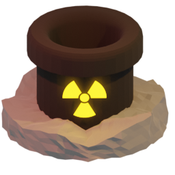
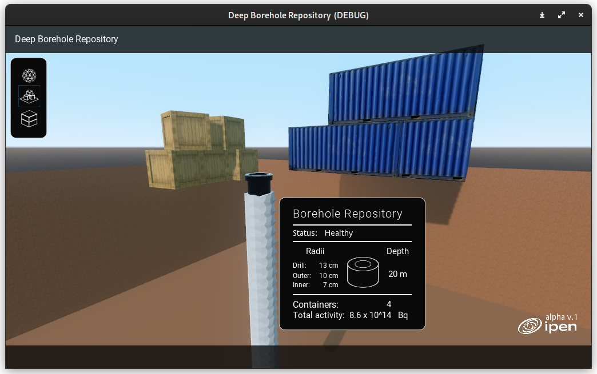
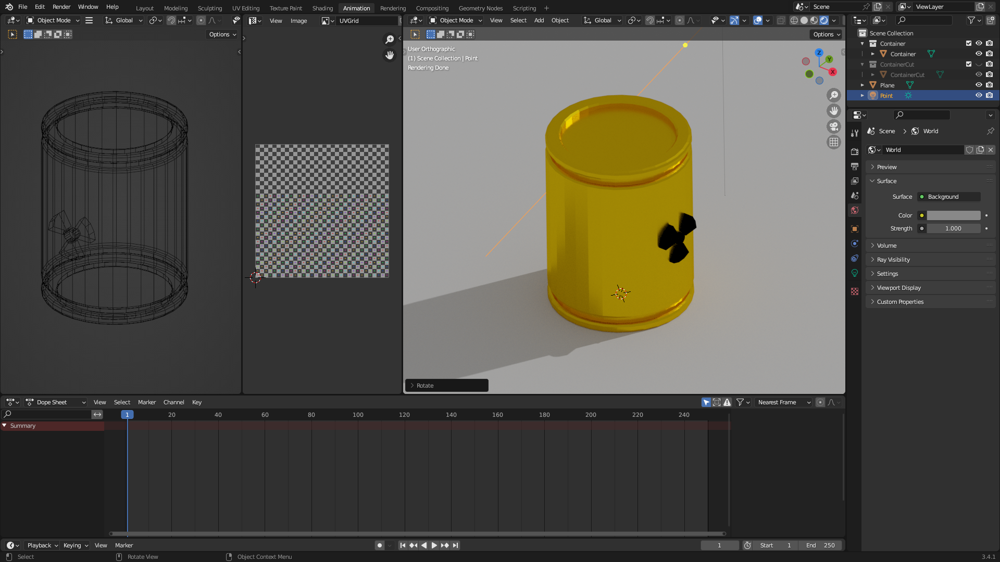

# Computational Modeling of Borehole Repositories

  
  
  **Simulation & 3D Visualization**
  
  *Deep Borehole Repositories* 
  
  
  
  
  

## Description

Computational modeling using Blender 3D and Godot Engine can be used to create a digital representation of deep borehole repositories for DSRSs (Disused Sealed Radioactive Sources) disposal. The modeling process involves creating a detailed 3D design of the repository, which can be used to simulate the behavior of the radioactive materials as they are disposed of in the borehole.

This project is being developed using the following tools:

- **Blender 3D** - 3D modeling software
- **Godot Engine** - Game engine for logic and programming

 
 

In Blender, the modeling process begins with creating a detailed 3D model of the borehole and the surrounding geological features. This can be accomplished using a variety of tools and techniques, such as sculpting, texturing, and lighting. Once the model is complete, it can be exported in a format that can be used by the Godot Engine.

Godot is a powerful game engine that can be used to create interactive simulations of the deep borehole repository. Using the 3D model created in Blender, Godot can simulate the disposal of the radioactive sources and the behavior of the materials over time. This can include factors such as heat generation, radiation levels, and the movement of materials within the borehole.

The resulting simulation can be used to analyze the effectiveness of the repository design and to identify potential issues or hazards that may arise during the disposal process. Additionally, the simulation can be used to create training materials for personnel involved in the disposal process, allowing them to gain experience with the procedure before actually handling the materials.

Overall, computational modeling using Blender 3D and Godot Engine can provide a powerful tool for designing and analyzing deep borehole repositories for disused sealed radioactive sources disposal. By simulating the behavior of the materials in a virtual environment, it is possible to identify potential issues and improve the design of the repository to ensure the safe disposal of these hazardous materials.

## Getting Started

To build the program, you must have installed the Godot Engine, learn more about it on [Godot website](https://godotengine.org).

## Contact

To learn more about the project, contact me at [ivfreire(at)usp.br](mailto:ivfreire@usp.br), or reach out to me on Twitter 
[@ovfreire](https://twitter.com/ivfreire).

## Authors

1. [Ícaro Freire](https://github.com/ivfreire) - *Physics BSc student at USP and intern at IPEN/CNEN*
2. [Roberto Vicente](http://lattes.cnpq.br/9314928031812405) - *Nuclear Technology PhD and professor at IPEN/CNEN*

## WMS2023 Student Poster Presentation

This project was presented at the WMS2023 in Phoenix, Arizona.

## Acknowledgements

This project was possible thanks to:

- [IPEN](https://www.ipen.br) - *Institute of Energy and Nuclear Research*
- [CNEN](https://www.gov.br/cnen/pt-br) - *Brazilian National Comission for Nuclear Energy*
- [IAEA](https://www.iaea.org/) - *International Atomic Energy Agency*
- [WMS](https://www.wmsym.org/) - *Waste Management Symposia, Inc.*

##

- Thanks for visiting!
